# Arroz al horno para 5 personas

## Ingredientes

- 3,5 tazas de arroz (Tazas de café con leche)
- Un bote grande de garbanzos (500g)
- Una patata
- Un tomate
- Colorante alimenticio
- Un ajo
- Un puñado de sal
- Aceite de oliva 0.4
- Arreglo para cocido (la bandeja grande de mercadona)

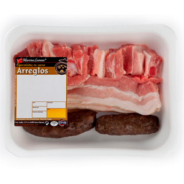

## Hardware

- Un horno
- Una cazuela de barro de unos 40 cm de diámetro (TODO: ¡Comprobar!)
- Una sartén grande

## Preparación

- Lo primero, tenemos que preparar todos los ingredientes para hacer el sofrito
    - Cortamos los trozos de carne para que queden más pequeños que como normalmente vienen en el arreglo. La idea es que queden como "bocados" de carne.
    - La morcilla va al sofrito entera
    - La patata la cortamos en rodajas tirando a finas (sin que queden como papel de fumar). Es el mismo corte que para hacer patatas a lo pobre.
    - Cortamos el tomate de manera similar a las patatas. Tiene que quedar en rodajas gorditas.
    - Al ajo le cortamos la punta y le damos un corte por la mitad. Se deja sin pelar (o cuanto apenas).

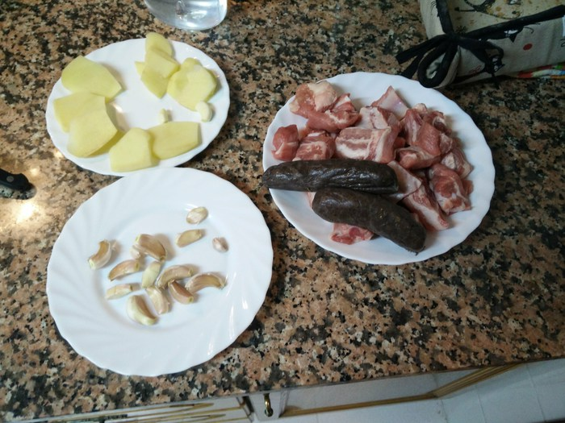

- Echamos el aceite de oliva en la sartén donde vamos a hacer el sofrito y dejamos que se caliente. Debe haber bastante aceite pero no es necesario cubrir toda la base.
- Echamos a la sartén la carne, el ajo, la patata y las morcillas. Debemos dejar que todo se haga de manera uniforme y para eso hay que remover bastante a menudo, tratando de no destrozar las morcillas y la patata. El fuego tiene que estar relativamente fuerte.

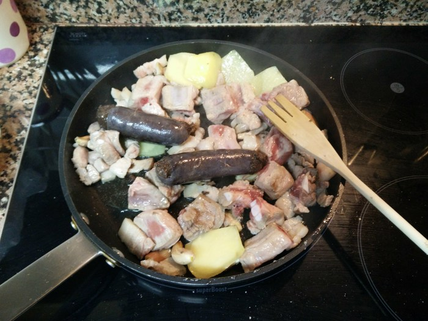

- Lo primero que se hace son las morcillas, que retiramos antes de que se deshagan.

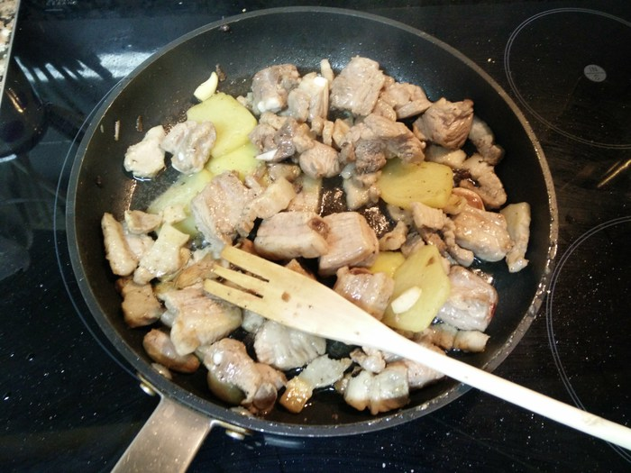

- Después, retiramos las patatas, por el mismo motivo.
- Seguimos removiendo para que la carne se termine de hacer.
- Quizás este sea un buen momento para ir precalentando el horno a 250º.

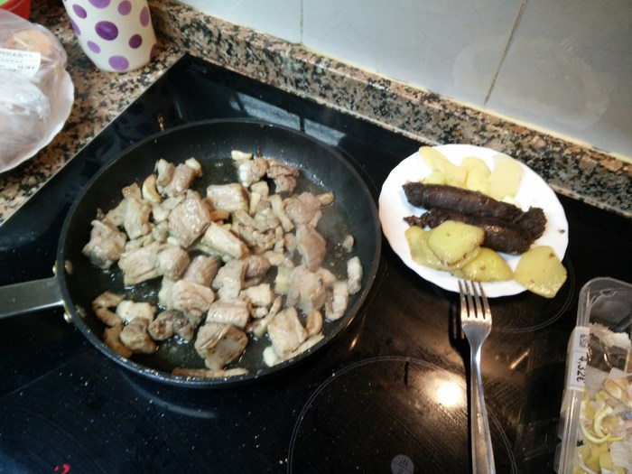

- Un poco antes de que se termine de hacer la carne podemos echar el tomate en la sarten para que se haga un poquito.

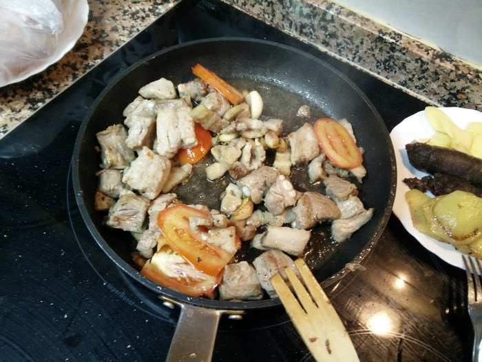

- Cuando la carne ya está hecha, la sacamos (con los ajos) pero con cuidado de que quede el máximo posible de aceite en la sartén.

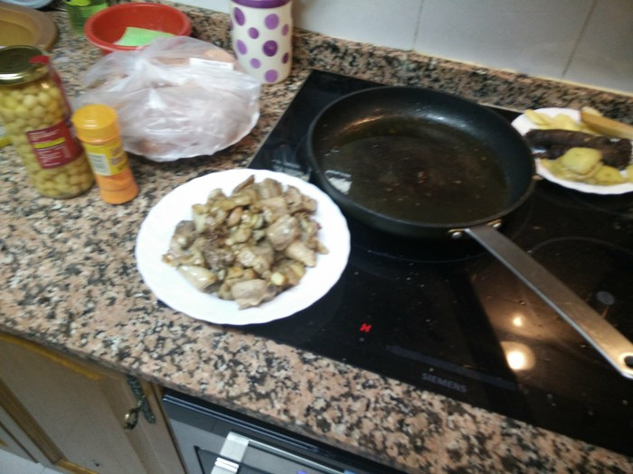

- En el aceite que queda en la sartén, echamos el arroz y lo removemos para que se impregne de todo el aceite.
- Apagamos el fuego de la sartén.

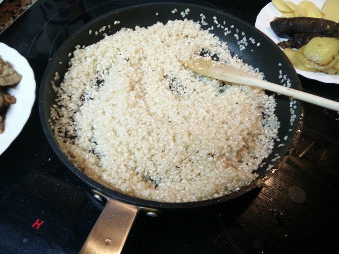

- Echamos el arroz en la cazuela y lo repartimos de manera (más o menos uniforme).
- Añadimos 2 tazas de agua por cada taza de arroz que hayamos puesto.

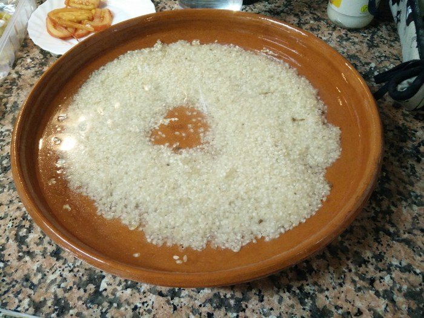

- Añadimos el resto de ingredientes a la cazuela.
    - Primero, la carne y los garbanzos (escurridos), que repartimos para que se distribuyan uniformemente.
    - Añadimos el colorante alimentario (un par de cucharaditas).
    - Después las morcillas, las rodajas de patata y de tomate. Esto ya lo podemos considerar "decoración".

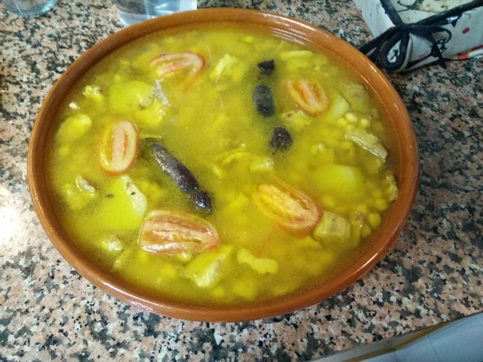

- Metemos la cazuela en la parte superior del horno.
- Mantenemos la cazuela en el horno durante 40 minutos.

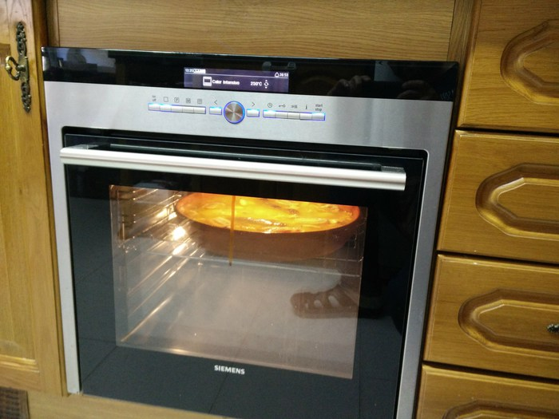

- Sacamos la cazuela del horno y dejamos reposar unos minutos.
- ¡A comer!

## Agradecimientos

Receta original de Amparo Montoya Álvarez :heart:

