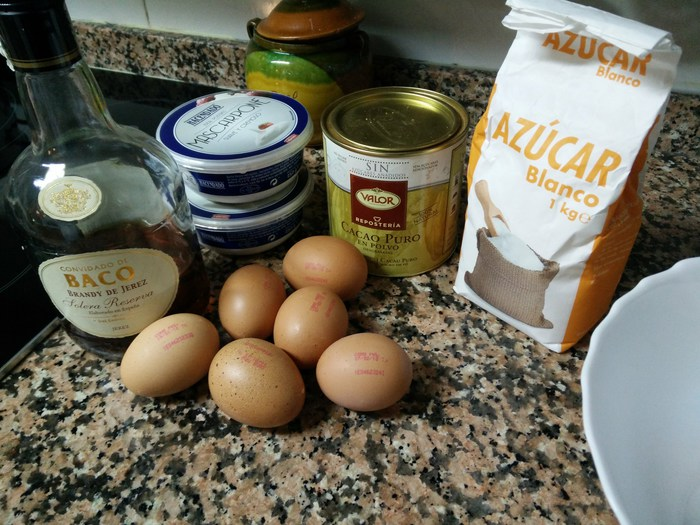
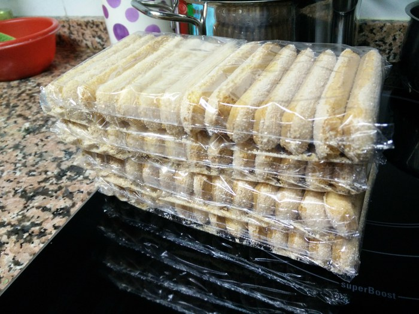

# Tiramisú

## Ingredientes <!-- TODO: Poner las cantidades exactas -->

- Azúcar. (¡Mucho!)
- 2 tarrinas de queso mascarpone
- 6 huevos
- Cacao puro en polvo
- Licor (Amaretto o brandy en su defecto)

- Bizcochos "lengua de gato", también llamados "ladyfingers". En algunos sitios los llaman bizcochos de soletilla, pero si es un bizcocho blandito entonces es mucho más difícil de manejar cuando lo "emborrachas". 

## Hardware

- Una batidora con un montador de claras (aunque a mano también se puede)
- Una barilla
- Una lengua
- Un colador pequeño
- Una bandeja de 30x40 cm aprox.
- 2 Boles, uno más grande que otro
- (Opcional) Separador de claras

## Elaboración

### Preparación del café y el cacao (un rato antes de empezar con el resto de cosas)

<!-- TODO: Poner las cantidades exactas -->

- Hervimos en un cazo XXXX cucharadas de café de cafetera. El café sólo tiene que dar un hervor. Dejamos que el café se enfríe.

- Colamos el café en un plato, que es donde vamos a emborrachar los bizcochos.
- Añadimos un chorro de licor a la mezcla (a gusto del consumidor)

- Ponemos un poco de cacao en el colador y lo dejamos preparado. Cuando nos pongamos con el tiramisú queremos ser rápidos para meterlo en la nevera lo antes posible.

### Preparación de la mezcla

- Separamos las yemas de las claras.

- Añadimos XXXX cucharadas soperas de azúcar a las yemas.

- Mezclamos bien el azúcar con las yemas para que quede una mezcla uniforme.

- Añadimos todo el queso mascarpone a las yemas. Batimos bien para que quede una mezcla uniforme.

- Montamos las claras al punto de nieve. Lo típico-tópico que se suele decir aquí es que las claras deben quedar tan montadas que puedas darle la vuelta al recipiente sin que se derrame. 

- Poco a poco, vamos echando las claras montadas a la mezcla de las yemas y el mascarpone.

- Hay que ir mezclando poco a poco las claras para que no echar a perder su consistencia. No queremos que las claras vuelvan a ser líquidas.

- Al final, debe quedar una mezcla que sea más o menos uniforme pero que mantenga la consistencia de las claras.

### Montaje del tiramisú

- Los bizcochos deben pasar por el café con el licor pero sólo lo suficiente para que cojan un poco de líquido. No se trata de que se ablanden con el café. Se ablandarán con la mezcla que echaremos después. En la imagen, el café sale menos oscuro porque en esta ocasión añadimos un poco de leche (lo cual es totalmente opcional).

- Colocamos una primera capa de bizcochos, cubriendo toda la superficie de la bandeja.

- Cubrimos cada capa de bizcochos con la mezcla. Tenemos que ser rápidos porque la mezcla tenderá a ponerse más líquida y los bizcochos tenderán a ponerse más blandos. Hay que dejar la capa de mezcla uniformemente repartida. 

- Espolvoreamos el cacao. No es necesario cubrir totalmente la mezcla, aunque esto también va a gusto del consumidor.

- Las capas de bizcocho, mezcla y cacao se van sucediendo. En este recipiente llegaron a entrar 3 capas.

- Así queda el resultado final con la última capa.

- Por último, tapamos el tiramisú para que no se reseque y lo metemos en la nevera hasta el día siguiente. :yum:

## Agradecimientos

Receta original de Amparo Montoya Álvarez :heart: