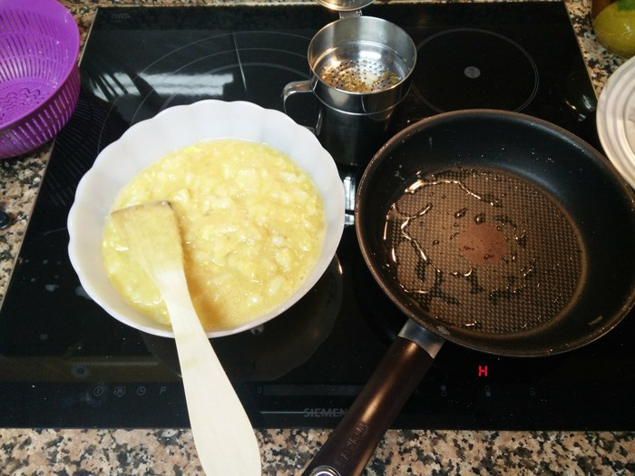

# Tortilla de patata y cebolla

## Ingredientes

- 2 patatas grandes
- 4 huevos
- 1 cebolla
- Aceite de oliva 0.4

## Hardware

- Una sartén que no se pegue
- Un plato que encaje bien en la sartén para dar la vuelta a la tortilla
- Una pala de madera
- Una espumadera
- Un bol grande
- (Opcional) Una tapa para la sartén

## Elaboración

- Cortamos la patata en pedazos pequeños del tamaño de medio pulgar.
- Cortamos la cebolla en trozos bastante finos (sin llegar a picarla).

- Ponemos un dedo de aceite en la sartén y lo calentamos.

- Echamos la patata y la cebolla y empezamos a freír a fuego medio.

- Es conveniente que tapemos la patata y la cebolla para que se hagan blanditas antes. No hay que dejar de remover la patata para que se haga de manera uniforme pero hay que tener cuidado de no destrozarla demasiado.

- Mientras, batimos los huevos en un bol o en un plato hondo. Añadimos una pizca de sal al huevo.

- También añadimos sal a las patatas. Aquí se puede echar un puñadito de sal (sin pasarse).

- Para comprobar que la patata va quedando bien, podemos ir partiéndola con la pala. La patata estará hecha cuando se haya reblandecido y no cueste partirla.

- Con la patata ya hecha, la sacamos poco a poco de la sartén a un bol intentando que suelte el máximo de aceite. Para ello es útil ayudarse de una espumadera.
- Vaciamos el aceite de la sartén en otro recipiente. Este aceite se puede reutilizar.

- Devolvemos la mezcla a la sartén con el poco aceite que le quede, que apenas serán unas gotas.

- Dejamos que la mezcla del huevo y la sartén cuajen a fuego relativamente lento. Cuanto más tiempo lo dejemos, menos cruda nos quedará la tortilla. Aquí va mucho a gusto del consumidor. Hay gente que le gusta la tortilla muy hecha y gente a la que le gusta prácticamente cruda.
- Para dar la vuelta a la tortilla hay que usar un plato grande. En la imagen, el plato que hemos utilizado un plato de pizza, que es un poco exagerado pero funciona bien. Es bueno poner un trapo sobre el plato para que al darle la vuelta a la tortilla este trapo quede sobre nuestro brazo. Así evitaremos desagradables quemaduras. 

- Una vez le hemos dado la vuelta a la tortilla, la devolvemos a la sartén y la dejamos unos pocos minutos para que se haga por la otra parte.
- Sacamos la tortilla de la sartén y la dejamos reposar unos minutos.

:yum:

## Agradecimientos

Receta original de Amparo Montoya Álvarez :heart: